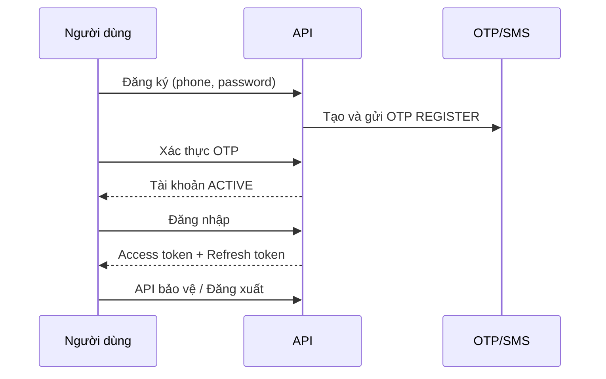
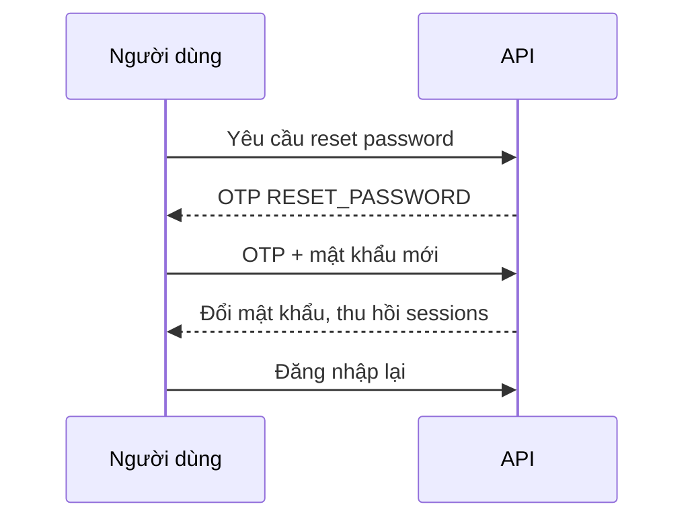
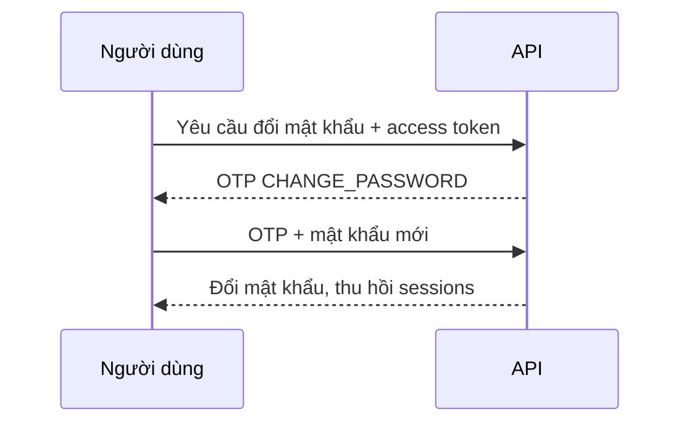
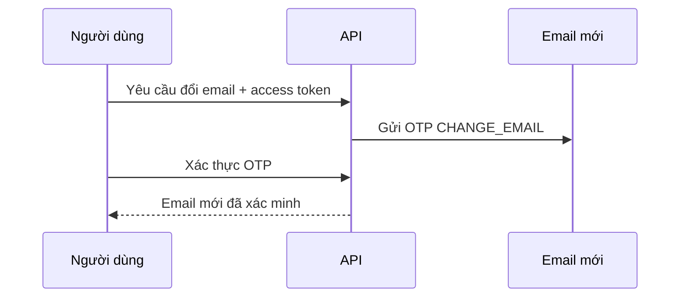
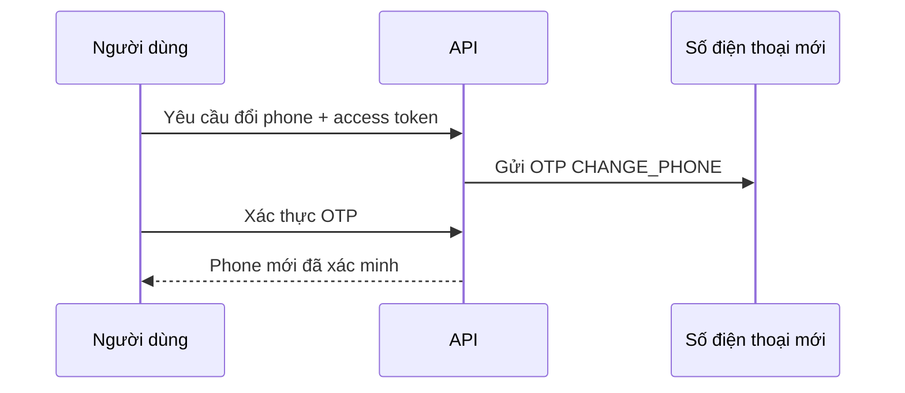
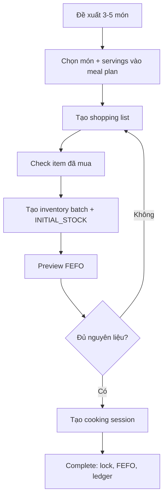
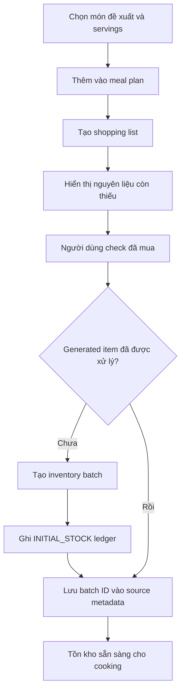
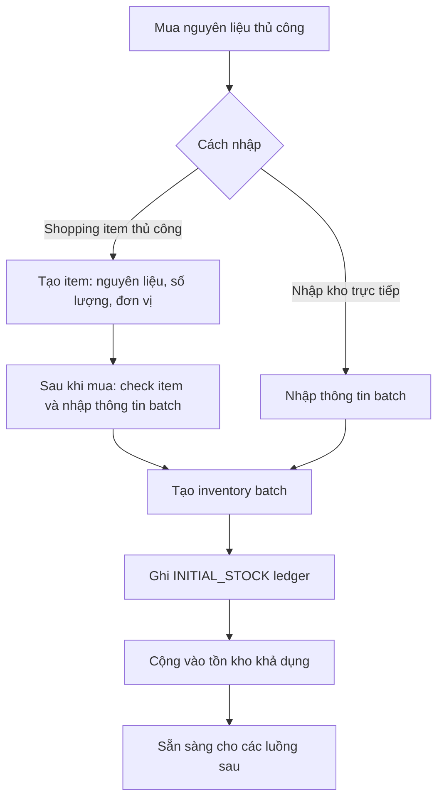

# Các luồng trong sản phẩm

## Luồng đăng ký - đăng nhập

### Các bước chi tiết

1. Người dùng gửi số điện thoại E.164, mật khẩu và thông tin hồ sơ tùy chọn đến `POST /api/auth/register`.
2. Hệ thống tạo tài khoản `UNVERIFIED` và gửi OTP đăng ký qua SMS; người dùng nhập OTP vào `POST /api/auth/verify/register` để kích hoạt tài khoản.
3. Người dùng đăng nhập bằng số điện thoại và mật khẩu tại `POST /api/auth/login` để nhận access token và refresh token.
4. Ứng dụng dùng access token cho các API bảo vệ; khi hết hạn, dùng `POST /api/auth/token/refresh` để lấy access token mới.
5. Người dùng đăng xuất qua `POST /api/auth/logout`; refresh token tương ứng bị thu hồi.

### Sơ đồ

## Luồng đổi mật khẩu

### Forgot password (No Authentication)

#### Các bước chi tiết

1. Người dùng quên mật khẩu, nhập số điện thoại tại `POST /api/auth/password/reset`.
2. Hệ thống gửi OTP `RESET_PASSWORD` mà không tiết lộ số điện thoại có tài khoản hay không.
3. Người dùng gửi số điện thoại, OTP, mật khẩu mới và `purpose = RESET_PASSWORD` đến `POST /api/auth/verify/change-password`.
4. Hệ thống đổi mật khẩu và thu hồi mọi session đang hoạt động; người dùng đăng nhập lại.

#### Sơ đồ

### Reset Password (Authenticated)

#### Các bước chi tiết

1. Người dùng đã đăng nhập gọi `POST /api/auth/password/change`.
2. Hệ thống gửi OTP `CHANGE_PASSWORD` đến số điện thoại hiện tại.
3. Người dùng xác nhận OTP, số điện thoại, mật khẩu mới và `purpose = CHANGE_PASSWORD` tại `POST /api/auth/verify/change-password`.
4. Hệ thống cập nhật mật khẩu, thu hồi các session; người dùng đăng nhập lại bằng mật khẩu mới.

#### Sơ đồ

## Luồng đổi email / phone

### Đổi email

#### Các bước chi tiết

1. Người dùng đã đăng nhập gửi email mới đến `POST /api/users/me/email/request-verification`.
2. Hệ thống lưu email chờ xác thực theo user và gửi OTP đến email mới.
3. Người dùng gửi OTP đến `POST /api/users/me/email/verify`.
4. Hệ thống xác nhận OTP và lưu email mới là email đã xác minh.

#### Sơ đồ

### Đổi phone

#### Các bước chi tiết

1. Người dùng đã đăng nhập gửi số điện thoại mới đến `POST /api/users/me/phone/request-change`.
2. Hệ thống lưu số điện thoại chờ xác thực và gửi OTP `CHANGE_PHONE` đến số mới.
3. Người dùng gửi OTP đến `POST /api/users/me/phone/confirm-change`.
4. Hệ thống kiểm tra OTP, kiểm tra số điện thoại chưa được dùng và thay thế số điện thoại hiện tại.

#### Sơ đồ

## Luồng quét món ăn & lên kế hoạch nấu

### Các bước chi tiết

1. Người dùng yêu cầu đề xuất món cho bữa ăn và số servings; theo PRD, hệ thống trả 3–5 món cùng mức độ đáp ứng, nguyên liệu thiếu và lý do xếp hạng.
2. Người dùng chọn món, số servings, ngày và khung bữa ăn để thêm vào meal plan.
3. Người dùng tạo shopping list từ meal plan; hệ thống cộng nhu cầu đã scale theo servings, trừ tồn kho còn dùng được và chỉ trả nguyên liệu thiếu.
4. Sau khi mua, người dùng check từng shopping item. Theo luồng sản phẩm đã chốt, hệ thống tạo batch inventory và `INITIAL_STOCK` ledger cho item generated vừa được check.
5. Trước khi nấu, người dùng gọi `POST /api/cooking/preview` với `meal_plan_item_id` để xem FEFO, batch dự kiến dùng, cảnh báo và nguyên liệu thiếu. Hệ thống lấy recipe và servings từ meal-plan item.
6. Người dùng tạo session qua `POST /api/cooking/sessions` chỉ với `meal_plan_item_id`. API lấy recipe/servings từ item và chỉ tạo session khi tồn kho hiện tại đủ; nếu thiếu trả `409` nêu rõ nguyên liệu và số lượng thiếu.
7. Sau khi nấu, người dùng gọi `POST /api/cooking/sessions/{session_id}/complete` với `Idempotency-Key` và mode tiêu thụ. Hệ thống lock batch, revalidate, trừ tồn kho FEFO và ghi ledger.

*Một bữa ăn (meal) được đề xuất được tạo thành từ nhiều món ăn (recipe). Người dùng chọn ra các món cần nấu từ danh sách đề xuất và tiến hành thêm vào để tạo một bữa ăn (meal). Hệ thống sẽ lên danh sách shopping list cho người dùng để hoàn thiện bữa ăn này. Người dùng check và tiến hành di mua đồ ăn.*

### Sơ đồ

## Luồng mua sắm, bổ sung nguyên liệu vào kho

### Mua theo danh sách đề xuất lúc quét món ăn

#### Các bước chi tiết

1. Người dùng chọn các món được đề xuất, thêm vào meal plan kèm servings, rồi yêu cầu tạo shopping list.
2. Hệ thống quy đổi định lượng theo servings, trừ tồn kho khả dụng và tạo các generated shopping item cho phần nguyên liệu còn thiếu.
3. Sau khi mua, người dùng check từng generated item chưa được check.
4. Ở lần check đầu tiên, hệ thống tạo một raw-ingredient batch thuộc user với `missing_quantity`, dùng catalog ingredient/đơn vị của item và ghi `INITIAL_STOCK` ledger.
5. Batch ID được lưu trong `source_metadata`; check lại cùng item không tạo thêm tồn kho. Batch mới được tính vào preview, recommendation và điều kiện tạo cooking session.

#### Sơ đồ

### Bổ sung nguyên liệu thủ công vào kho

#### Các bước chi tiết

Chúng ta có 2 cách để tăng nguyên liệu trong kho
+ Qua shopping item thủ công: ghi thứ cần mua → mua xong → check → tạo inventory batch.
+ Nhập batch trực tiếp: đã mua nguyên liệu rồi → nhập thông tin lô hàng → tạo inventory batch ngay.

1. Người dùng chọn một trong hai cách: tạo shopping item thủ công để ghi nhớ cần mua, hoặc nhập trực tiếp lô nguyên liệu đã mua vào kho.
2. Với shopping item thủ công, người dùng chỉ nhập nguyên liệu, số lượng và đơn vị cần mua. Item này chưa làm tăng tồn kho.
3. Sau khi mua, người dùng check shopping item. Hệ thống yêu cầu hoặc áp dụng thông tin batch cần thiết, như nơi bảo quản và hạn dùng, rồi tạo inventory batch.
4. Với nhập kho trực tiếp, người dùng nhập nguyên liệu, số lượng, đơn vị, nơi bảo quản và hạn dùng (nếu có), sau đó xác nhận tạo inventory batch ngay; không cần shopping item.
5. Ở cả hai cách, hệ thống ghi `INITIAL_STOCK` ledger (lịch sử biến động tồn kho) cho batch mới. Batch này được cộng vào tồn kho khả dụng, không cần liên kết với recipe hoặc meal plan và sẵn sàng cho các luồng sau.

#### Sơ đồ

