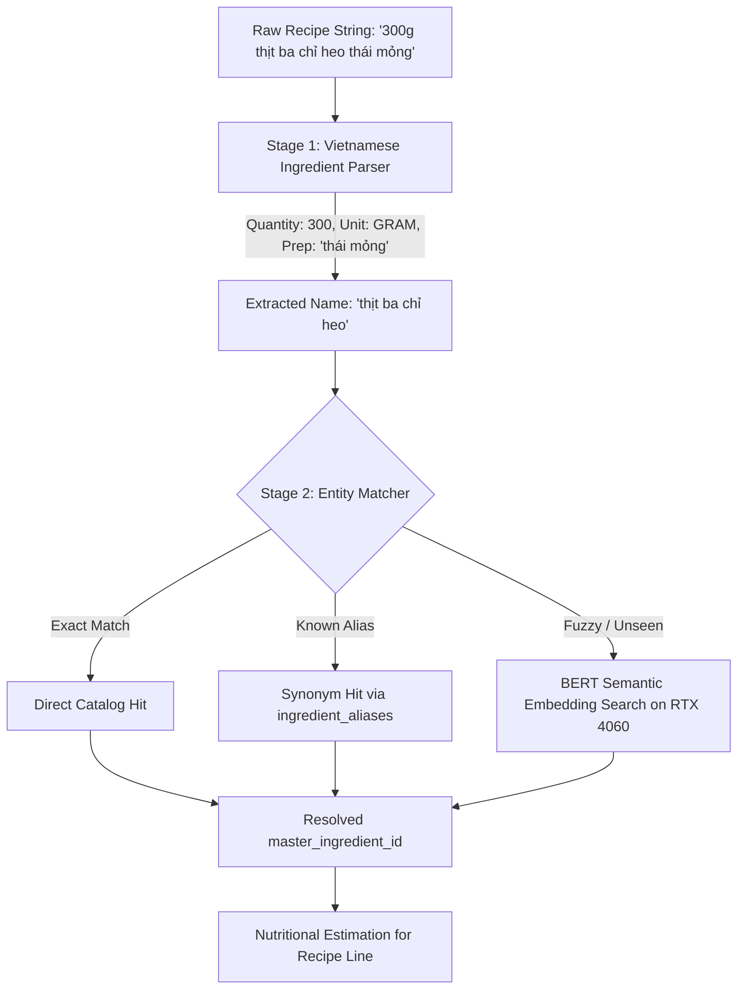

# SweepFood NLP & Ingredient Entity Resolution Engine

This module provides the core Natural Language Processing engine to parse and semantically resolve ingredient text from recipes, grocery receipts, and voice transcriptions to the **853 canonical Master Ingredients** from the National Institute of Nutrition (Viện Dinh Dưỡng).

---

## 1. System Architecture & Model Selection

### Hardware Optimization
* **Target GPU**: NVIDIA GeForce RTX 4060 Laptop (8GB VRAM).
* **CUDA Support**: CUDA 12.4+ (`cu124`).
* **Inference Mode**: FP16 (`torch.float16`) Tensor Core acceleration.
* **Latency**: $< 5\text{ ms}$ per ingredient query on GPU.

### NLP Model Choices
1. **`bkai-foundation-models/vietnamese-bi-encoder` (Default)**:
   * State-of-the-art Vietnamese Bi-Encoder trained by BKAI for dense retrieval and semantic sentence similarity.
   * Directly encodes Vietnamese phrases into 768-dimensional normalized vectors.
   * Computes cosine similarity via GPU matrix multiplication ($\mathbf{U} \cdot \mathbf{v}^\top$).
2. **`vinai/phobert-base-v2`**:
   * Official PhoBERT v2 model from VinAI.
   * Supported via mean-pooling across the last hidden state.

---

## 2. Multi-Stage Pipeline Overview



### Stage 1: Syntactic Parser (`ingredient_parser.py`)
* Extracts numerical quantities, fractions (`1/2`, `3/4`, `½`), and ranges (`1-2` $\rightarrow 1.5$).
* Standardizes Vietnamese units to `MeasurementUnit` (`kg`, `g`, `lạng` $\rightarrow 100\text{g}$, `muỗng canh`, `thìa cà phê`, `quả`, `tép`, `nhánh`...).
* Extracts preparation notes (e.g. `(thái hạt lựu)`, `băm nhỏ`, `làm sạch`).
* Detects optionality (`tùy thích`, `nếu có`).

### Stage 2: Semantic Entity Matcher (`entity_matcher.py`)
* Embeds all 853 master ingredients on GPU memory ($\sim 250\text{MB}$ VRAM).
* High-confidence semantic matches ($\ge 0.88$) automatically feed into the `ingredient_aliases` table to continuously expand vocabulary.

### Stage 3: Nutritional Portions Calculation (`pipeline.py`)
* Calculates total calories, protein, fat, and carbs for the required recipe amount.

---

## 3. High-Throughput Vectorized GPU Batching

For large recipe datasets, processing items sequentially causes significant CPU-GPU synchronization overhead. We implemented vectorized batch inference (`match_batch` and `process_batch`):

1. **Batched Multi-Threaded Parsing**: CPU thread pool parses quantity/units in parallel.
2. **Batched GPU Tokenization & Forward Pass**: Encodes queries in tensor batches (`batch_size=256`).
3. **GEMM Batched Cosine Similarity**: Single CUDA kernel matrix multiplication:
   $$\mathbf{S}_{M \times 853} = \mathbf{Q}_{M \times 768} \times \mathbf{K}_{853 \times 768}^\top$$
4. **Batched GPU Top-K**: `torch.topk(S, k=3, dim=1)` ranks all candidates simultaneously.

### Benchmark Results on NVIDIA RTX 4060 (500 Items)

| Execution Mode | Latency (s) | Throughput (items/sec) | Speedup vs Baseline | Peak GPU VRAM |
| :--- | :--- | :--- | :--- | :--- |
| **Sequential (1-by-1)** | 7.625 s | 65.6 it/s | 1.0x (Baseline) | ~200 MB |
| **Batched (B=32)** | 1.132 s | 441.7 it/s | 6.7x Faster | 291.2 MB |
| **Batched (B=64)** | 1.423 s | 351.4 it/s | 5.4x Faster | 294.3 MB |
| **Batched (B=128)** | 2.142 s | 233.4 it/s | 3.6x Faster | 303.1 MB |
| **Batched (B=256)** | **0.719 s** | **695.0 it/s** | **10.6x FASTER** | **307.8 MB** |

---

## 4. Usage & Benchmark Commands

### Running Grammar Parsing Tests
```bash
python nlp/test_parser.py
```

### Running the End-to-End Pipeline Demo
```bash
C:\Users\HUYPNG\miniconda3\envs\ocr_env\python.exe nlp/demo_pipeline.py
```

### Running the GPU Batch Benchmark
```bash
C:\Users\HUYPNG\miniconda3\envs\ocr_env\python.exe nlp/benchmark_batch.py
```
